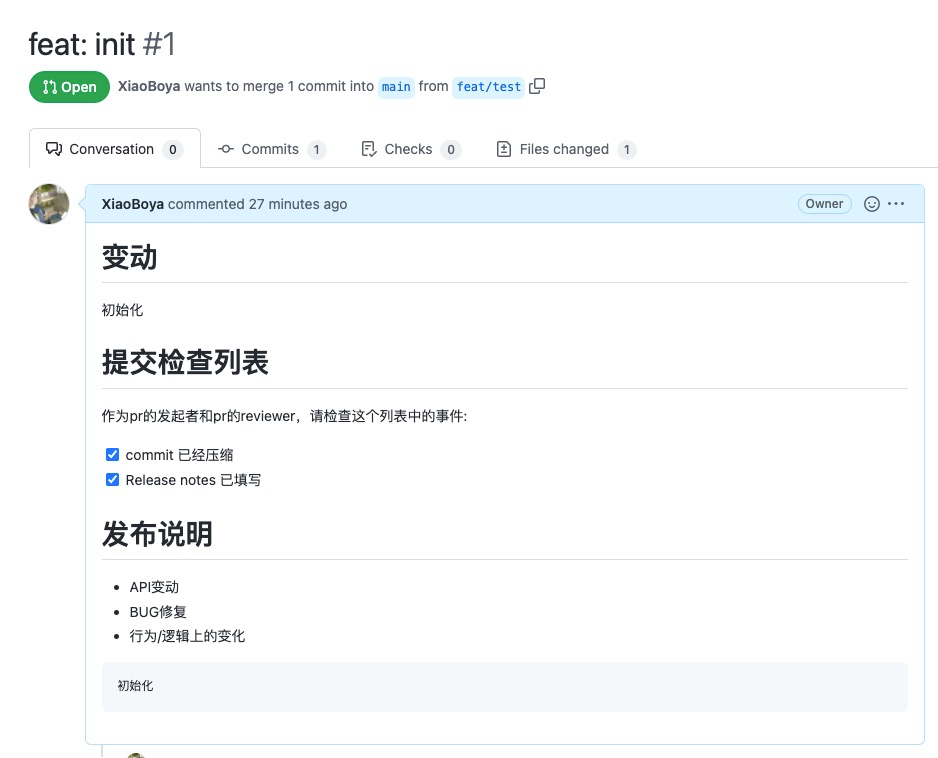

# 代码提交规范

编写目的，提高代码commit的可阅读性，增强功能代码的快速追溯能力以及问题的快速排查能力。

## 1 commit的内容编写规范

https://zhuanlan.zhihu.com/p/90281637

commit中应包含提交的类型：

    feat: 新功能、新特性
    fix: 修改 bug
    hotfix: 发版后的bug修复
    perf: 更改代码，以提高性能（在不影响代码内部行为的前提下，对程序性能进行优化）
    refactor: 代码重构（重构，在不影响代码内部行为、功能下的代码修改）
    docs: 文档修改
    style: 代码格式修改, 注意不是 css 修改（例如分号修改）
    test: 测试用例新增、修改
    build: 影响项目构建或依赖项修改
    revert: 恢复上一次提交
    ci: 持续集成相关文件修改
    chore: 其他修改（不在上述类型中的修改）
    release: 发布新版本
    workflow: 工作流相关文件修改(github工作流)

commit格式如:

    feat: 审批流查询接口

## 2 pr提交规范

### 2.1 每个pr应该是一个功能或是一个模块

每个pr的提交应该只包含一个功能的修改或新增或者是一个模块的修改和新增，已方便后续问题追溯的过程中可以快速的定位到一个pr对应的代码修改上

### 2.2 合并前准备

#### 2.2.1 合并前rebase目标分支

应该每次在分支提交之前，拉取目标分支代码，再切换回自己的分支再rebase master分支

```git
git checkout master
git pull
git checkout mybranch
git rebase master
```

如果出现冲突则解决冲突后再继续rebase

```git
解决冲突后
git add .
git rebase --continue
```

#### 2.2.2 合并前压缩commit

每次pr合并的时候应该注意压缩commit，保证主分支的整洁。假设一个pr中包含了3个commit

```git
git rebase -i HEAD~3 # 这里有几个commit就写几
```

rebase之后会两次进入vi编辑器

第一次进入出现以下内容

```
pick cf633f2 feat: add commit.md
pick 50d7f67 feat: rm .idea
pick ed50cb5 feat: edit gitignore
```

将后两个的pick改成s(pick代表使用，s代表保留，如果是想要移除某一条commit则将pick改为d)。保存退出(:wq)，取消(:q!)

第二次进入出现以下内容

```
# This is a combination of 3 commits. 
# This is the 1st commit message: 
 
feat: add commit.md 
 
# This is the commit message #2: 
 
feat: rm .idea 
 
# This is the commit message #3: 
 
feat: edit gitignore
```

这里是commit压缩以后生成新commit的提交信息，可以保留多行，"#"后为注释(单行)

### 2.3 pr title规范

如果开发的代码在工单系统里面有对应编号，比如bug单中有issue-XXXX唯一编号，那就在pr的title里面以“[issue-XXXX]”开头。

### 2.4 pr 提交描述规范

在代码仓库根目录下建立.github文件夹，文件夹下创建pull-request-template.md文件。这个文件的作用是在pr创建时自动生成pr的描述信息。



在变动中添加本次的代码变动描述（大部分都可以使用commit作为信息）

检查列表中是需要pr提交人员和pr审核人员需要取检查的信息（遵循markdown语法，在中括号中将空格改为x可出现图示效果）

在发布说明中有两项：

    代码变动类型
    版本说明

意义在于知道这个pr是进行了什么变动类型，同时在生成release的时候知道这个版本做了哪些事情

## 3 发版后bug修复

发版会基于某分支拉出release分支。在release分支拉取之后再进行bug修复，commit需要使用hotfix开头提交到release分支。
之后再cherry-pick到主分支。

```
git checkout release-0.1
git checkout -b hotfix-branch
# 完成代码修改并提交
git log # 获取commit的sha值
# 提交pr到release-0.1分支
git checkout master
git checkout -b fix-branch
git cherry-pick sha值
# 冲突的话就解决冲突之后 git add .再git cherry-pick --continue
# 向master分支提交pr
```

注意：只可以在master分支cherry-pick release分支，如果反向cherry-pick的话会导致出现大量不需要的commit

## 4 review通用术语

### 4.1 通过

lgtm： look good to me
